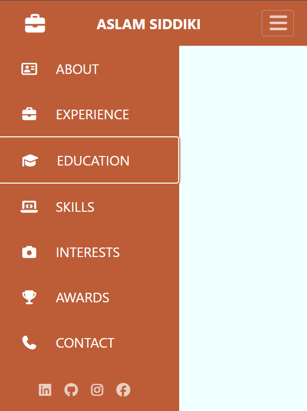
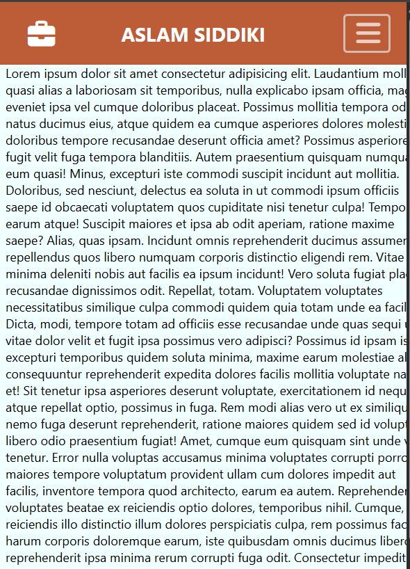
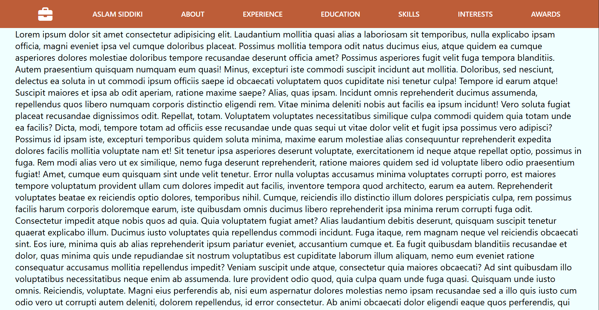

📱 Task 4: Make a Website Mobile-Friendly Using CSS Media Queries
📝 Objective

Convert an existing desktop-only webpage into a mobile-friendly layout using CSS media queries.

🛠 Tools Used

Any existing HTML file
VS Code (for editing HTML/CSS)
Chrome DevTools (for testing responsiveness)

🚀 Deliverables

Updated CSS with responsive design.
Fully functional layout that works on mobile devices.

📌 Steps Followed

🔍 Analyze HTML

Open the existing HTML page in VS Code.
Identify fixed-width elements, large images, and navigation bars.

📐 Write Media Queries
Target max-width: 768px to handle tablets and smaller devices.

🧩 Adjust Layout

Stack columns vertically.
Reduce font sizes for readability on smaller screens.
Make navigation menu collapse into a mobile-friendly sidebar.

🖼 Fix Images and Overflow

Ensure images scale inside containers.
Prevent content overflow and enable smooth scrolling.

🧪 Test Responsiveness

Use Chrome DevTools Device Toolbar to verify layout on multiple devices.
Adjust padding, margins, and positions as needed.

🎨 Features Implemented

✅ Mobile-first design for small screens.
✅ Collapsible sidebar navigation on mobile devices.
✅ Content area adjusts dynamically below navbar and sidebar.
✅ Font Awesome icons for menu items and social links.
✅ Smooth transitions when toggling sidebar.
✅ Scrollable content without overlapping menus.

## 📱 Live Demo

### Mobile View 1

### Mobile View 2

### Desktop View

🧑‍💻 Author

Aslam Siddiki

Web Developer | MERN Stack Intern  
📧 aslam.sidd888@gmail.com
